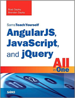

```
Roberto Nogueira  BSd EE, MSd CE
Solution Integrator Experienced - Certified by Ericsson
```

# AngularJS, Javascript and JQuery All in One



## Table of Contents

```
Part I: An Introduction to AngularJS, jQuery, and JavaScript Development
[ ] 1 Introduction to Dynamic Web Programming
[ ] 2 Debugging JavaScript in Web Pages
[ ] 3 Understanding Dynamic Web Page Anatomy
[ ] 4 Adding CSS/CSS3 Styles to Allow Dynamic Design and Layout
[ ] 5 Jumping into jQuery and JavaScript Syntax
[ ] 6 Understanding and Using JavaScript Objects

Part II: Implementing jQuery and JavaScript in Web Pages
[ ] 7 Accessing DOM Elements Using JavaScript and jQuery Objects
[ ] 8 Navigating and Manipulating jQuery Objects and DOM Elements with jQuery
[ ] 9 Applying JavaScript and jQuery Events for Richly Interactive Web Pages
[ ] 10 Dynamically Accessing and Manipulating Web Pages with JavaScript and jQuery
[ ] 11 Working with Window, Browser, and Other Non-Web Page Elements

Part III: Building Richly Interactive Web Pages with jQuery
[ ] 12 Enhancing User Interaction Through jQuery Animation and Other Special Effects
[ ] 13 Interacting with Web Forms in jQuery and JavaScript
[ ] 14 Creating Advanced Web Page Elements in jQuery
[ ] 15 Accessing Server-Side Data via JavaScript and jQuery AJAX Requests

Part IV: Utilizing jQuery UI
[ ] 16 Introducing jQuery UI
[ ] 17 Using jQuery UI Effects
[ ] 18 Advanced Interactions With jQuery UI Interaction Widgets
[ ] 19 Using jQuery UI Widgets to Add Rich Interactions to Web Pages

Part V: Building Web Applications with AngularJS
[ ] 20 Getting Started with AngularJS
[ ] 21 Understanding AngularJS Application Dynamics
[ ] 22 Implementing the Scope as a Data Model
[ ] 23 Using AngularJS Templates to Create Views
[ ] 24 Implementing Directives in AngularJS Views
[ ] 25 Creating Your Own Custom Directives to Extend HTML
[ ] 26 Using Events to Interact with Data in the Model
[ ] 27 Implementing AngularJS Services in Web Applications
[ ] 28 Creating Your Own Custom AngularJS Services
[ ] 29 Creating Rich Web Application Components the AngularJS Way
```
